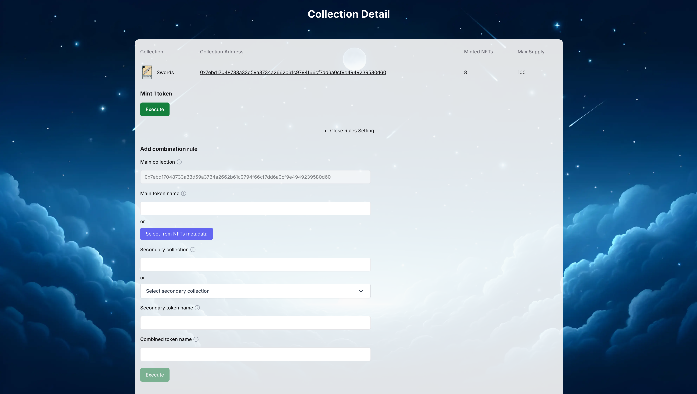
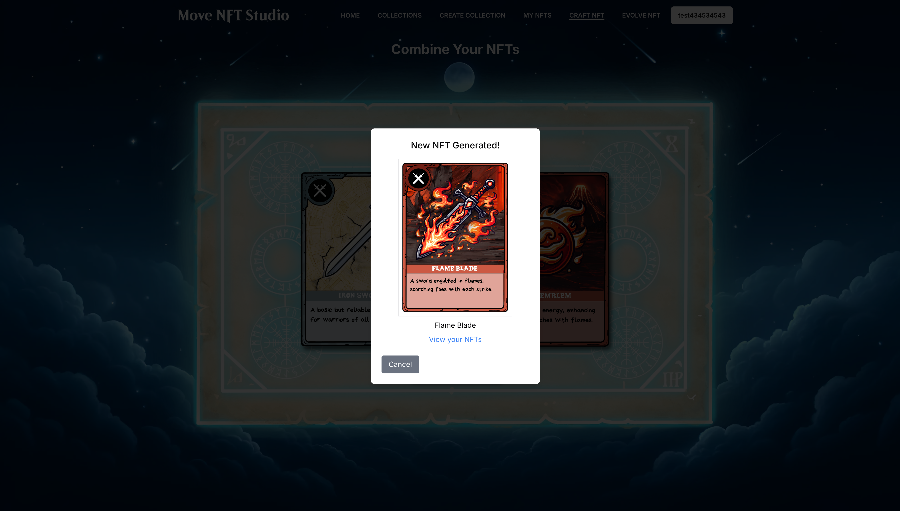
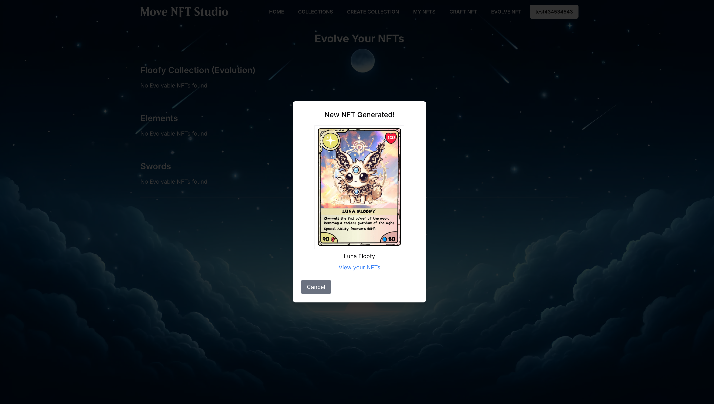

# 🖼️ Move NFT Studio
### Unlock Infinite Creativity with Dynamic NFTs – No Code Required.
<h4 align="center">
  
  <br>
  <br>
  <a href="https://aptos-move-nft-studio.netlify.app/">Website</a> |
  <a href="https://github.com/gmove-hackers/aptos-nft-studio">Github</a>
</h4>

The Move language enables advanced NFT features that are unavailable in popular standards like Solidity, but accessing these capabilities require technical expertise, making it complex and costly for non-coders.

The Move NFT Studio is a one stop shop for dynamic and composable NFT's. Creators can create collections, add combinations, evolutions and more. Users can then not only mint the NFT on the frontend, but also use the Move NFT Studio to interact with the NFT in whatever way the creator has configured it. The possibilities are endless!

⚙️ Built using Move, React, Vite, shadcn/ui and tailwind.

- 🗳️ **Easily create NFT collections**: With our intuitive creation page, creators can easily create new collections.
- 💗 **Dynamic NFT's**: Move NFT Studio allows creators to create dynamic collections, in any way they can imagine. Combine two NFT's, or allow NFT's to evolve after certain criteria have been met. The sky is the limit!
- 🏗️ **Composable NFT's**: Creators can define rules for equipment related to their collection. NFT holders can use Move NFT Studio to discover all the ways they can use or equip their NFT's.

## Screenshots

| Landing Page                   | Add New Rule               |
| ------------------------------ | ---------------------------- |
|  |  |

| Combine NFTs             | Combine NFTs Results                 |
| ------------------------------- | -------------------------------- |
|  |  |

| Evolve NFTs             | Evolve NFTs Results                 |
| ------------------------------- | -------------------------------- |
|  |  |

## Getting started

1. Set up the .env file and fill these values:
   ```
   VITE_APP_NETWORK=testnet
   VITE_COLLECTION_CREATOR_ADDRESS=0xC0FEE
   ```

2. Run the following commands from the project root to publish the Move modules:
   ```
   npm run move:publish
   ```

3. Install dependencies:
   ```
   npm install
   ```

4. Start the development server:
   ```
   npm run dev
   ```

5. Open http://localhost:5173/ in your browser to explore the Move NFT Studio:
   - Create, upload, and manage unique NFT collections
   - Modify and combine NFTs in innovative ways
   - Evolve your digital assets with custom rules

   Unleash your creativity and bring your NFT vision to life!


## Next steps
This hackathon project serves as a proof of concept for Move NFT Studio. Our goal is to continue building and expanding the platform so that creators and holders can manage every aspect of their NFTs. For more details and to track progress, [visit our GitHub Issues page](https://github.com/gmove-hackers/aptos-nft-studio/issues).

## Links
- [Deployed App](https://aptos-move-nft-studio.netlify.app/)
- [Demo video](https://www.youtube.com/watch?v=kDBK36v6aoQ)
- [Pitch deck](https://docs.google.com/presentation/d/1p24HYIaPSV_RrfspM2_iTCMhBXgl9ywv/edit?usp=sharing&ouid=107875262718829911448&rtpof=true&sd=true)
- [Deployment on Aptos Testnet](https://explorer.aptoslabs.com/account/0x93c5df502fe2fd532f866291d9b1fbcff5d870e5b5ed2617c2a50fe207b61cc2/modules/code/launchpad?network=testnet)

## Team 
- [Slothify](https://x.com/zkSlothify)
- [R3](https://x.com/987654_21)
- [arjanjohan](https://x.com/arjanjohan)
